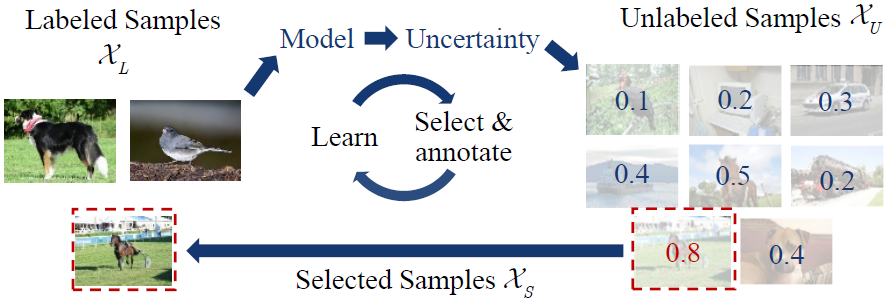
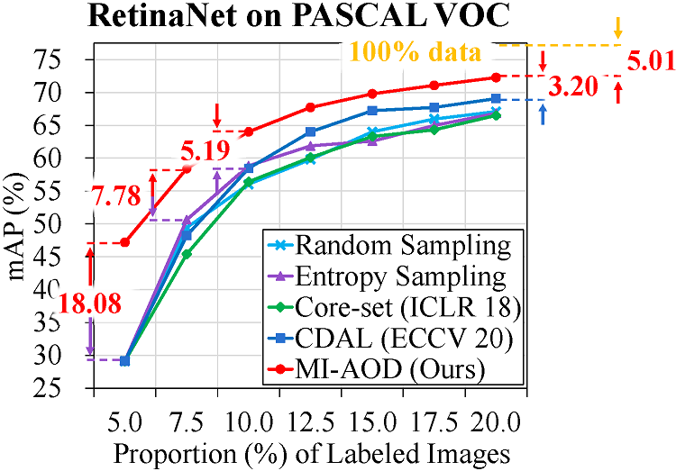

# MI-AOD

Language: [简体中文](README_cn.md) | English


[](https://github.com/yuantn/mi-aod/blob/master/LICENSE)

[](https://paperswithcode.com/sota/active-object-detection-on-pascal-voc-07-12?p=multiple-instance-active-learning-for-object)
[](https://paperswithcode.com/sota/active-object-detection-on-coco?p=multiple-instance-active-learning-for-object)

[](https://github.com/yuantn/mi-aod/issues)
[](https://github.com/yuantn/mi-aod/issues)

<!-- TOC -->

- [Introduction](#introduction)
- [Getting Started](#getting-started)
- [Model Zoo](#model-zoo)
- [Repository Contributor](#repository-contributor)
- [License](#license)
- [Citation](#citation)

<!-- TOC -->

## Introduction

This is the code for [***Multiple Instance Active Learning for Object Detection***](https://openaccess.thecvf.com/content/CVPR2021/papers/Yuan_Multiple_Instance_Active_Learning_for_Object_Detection_CVPR_2021_paper.pdf), CVPR 2021.

### Task Description

In this paper, we propose ___Multiple Instance Active Object Detection (MI-AOD)___, to select the most informative images for detector training by observing instance-level uncertainty.

The process of active object detection (active learning for object detection) is shown in the figure below.



First, a small set of images  (the labeled set) with instance labels  and a large set of images  (the unlabeled set) without labels are given. For each image, the label consists of bounding boxes  and categories  for objects of interest.

A detection model  is firstly initialized by using the labeled set {}. With the initialized model , active learning targets at selecting a set of images  from  to be manually labeled and merging them with  for a new labeled set , _i.e._, . The selected image set  should be the most informative, _i.e._, can improve the detection performance as much as possible.

> The informativeness in the figure above is embodied as the uncertainty. That is to say, with the sample in  input into the current model, if the output score of the model for each class is more uniform, the uncertainty of this sample is higher.

Based on the updated labeled set , the task model is retrained and updated to . The model training and sample selection repeat some cycles until the size of labeled set reaches the annotation budget.

### Illustration

MI-AOD defines an instance uncertainty learning module, which leverages the discrepancy of two adversarial instance classifiers trained on the labeled set to predict instance uncertainty of the unlabeled set. MI-AOD treats unlabeled images as instance bags and feature anchors in images as instances, and estimates the image uncertainty by re-weighting instances in a multiple instance learning (MIL) fashion. Iterative instance uncertainty learning and re-weighting facilitate suppressing noisy instances, toward bridging the gap between instance uncertainty and image-level uncertainty.

[Here](https://zhuanlan.zhihu.com/p/362764637) and [here](https://blog.csdn.net/yuantn1996/article/details/115490388) are more paper interpretation in Chinese.


### Innovation

- Creatively design a ***tailor-made*** method for the ***active learning + object detection*** task ***for the first time***.

- Achieve ***93.5%*** of the performance of 100% labeled data by using only ***20%*** of the labeled data on the PASCAL VOC dataset.

- Active learning was applied to the ***MS COCO*** dataset ***for the first time*** with the best performance.

- The idea is clear and simple, and can be generalized to ***any types of*** detection models.


### Boarder Impact

MI-AOD focuses on object detection (OD), but it can be also generalized to:
  - any other **visual object detection tasks** (tiny object detection, pedestrian detection, medical image detection),
  - any other **computer vision tasks** (human pose detection, semantic/instance segmentation, temporal action detection),
  - and any other **machine learning tasks** like natural language processing,

by combining active learning with these tasks. This bottom-up and top-down idea can be generalized and applied to any of these tasks.

Notice that active learning works a lot for visual object detection in MI-AOD, other learning methods with less supervision can be combined with it, such as:
  - active **few-shot** learning,
  - active **semi-/weak/self supervised** learning,
  - active **transfer** learning,
  - active **reinforcement** learning,
  - active **incremental** learning,

and so on. These combination of active learning and other learning method can promote each other to a greater extent.

## Getting Started

### Installation

Please refer to [Installation.md](./docs/installation.md) for installation.

### Data Preparation

Please download VOC2007 datasets ( *trainval* + *test* ) and VOC2012 datasets ( *trainval* ) from:

VOC2007 ( *trainval* ): http://host.robots.ox.ac.uk/pascal/VOC/voc2007/VOCtrainval_06-Nov-2007.tar

VOC2007 ( *test* ): http://host.robots.ox.ac.uk/pascal/VOC/voc2007/VOCtest_06-Nov-2007.tar

VOC2012 ( *trainval* ): http://host.robots.ox.ac.uk/pascal/VOC/voc2012/VOCtrainval_11-May-2012.tar

And after that, please ensure the file directory tree is as below:

```
├── VOCdevkit
│   ├── VOC2007
│   │   ├── Annotations
│   │   ├── ImageSets
│   │   ├── JPEGImages
│   ├── VOC2012
│   │   ├── Annotations
│   │   ├── ImageSets
│   │   ├── JPEGImages
```

You may also use the following commands directly:

```bash
cd $YOUR_DATASET_PATH
wget http://host.robots.ox.ac.uk/pascal/VOC/voc2007/VOCtrainval_06-Nov-2007.tar
wget http://host.robots.ox.ac.uk/pascal/VOC/voc2007/VOCtest_06-Nov-2007.tar
wget http://host.robots.ox.ac.uk/pascal/VOC/voc2012/VOCtrainval_11-May-2012.tar
tar -xf VOCtrainval_06-Nov-2007.tar
tar -xf VOCtest_06-Nov-2007.tar
tar -xf VOCtrainval_11-May-2012.tar
```

If you want to use SSD detectors instead of RetinaNet detectors, you can replace the configuration file in this repository as below:

```bash
mv configs/MIAOD.py configs/MIAOD_Retina.py
mv configs/MIAOD_SSD.py configs/MIAOD.py
```

For the SSD detector, because the vgg16 pre-trained model link provided in the mmcv 1.0.5 package is no longer available, the json file that loads the pre-trained model link needs to be updated to the latest version:

```bash
wget https://github.com/open-mmlab/mmcv/raw/master/mmcv/model_zoo/open_mmlab.json
cp -v open_mmlab.json $YOUR_ANACONDA_PATH/envs/miaod/lib/python3.7/site-packages/mmcv/model_zoo/
```

Please change the `$YOUR_ANACONDA_PATH` to your actual Anaconda3 installation directory. Usually it would be `~/anaconda3`.

After that, please modify the corresponding dataset directory, they are located in:

```python
Line 2 of configs/MIAOD.py: data_root='$YOUR_DATASET_PATH/VOCdevkit/'
Line 2 of configs/_base_/voc0712.py: data_root='$YOUR_DATASET_PATH/VOCdevkit/'
```

Please change the `$YOUR_DATASET_PATH`s above to your actual dataset directory (i.e., the directory where you intend to put the downloaded VOC tar file).

And please use the absolute path (i.e., start with `/`) but not a relative path (i.e., start with `./` or `../`）.

Please refer to [here](configs/README.md) for the information of other variables and parameters.

Please refer to [here](for_coco/README.md) for the data preparation on MS COCO.

### Train and Test

We recommend you to use a GPU but not a CPU to train and test, because it will greatly shorten the time.

And we also recommend you to use a single GPU, because the usage of multi-GPU may result in errors caused by the multi-processing of the dataloader.

However, thanks to [@Kevin Chow](https://github.com/kevinchow1993), [here](../../issues/11) is a feasible solution to train on multiple GPUs.

If you use only a single GPU, you can use the `script.sh` file directly as below:

```bash
chmod 700 ./script.sh
./script.sh $YOUR_GPU_ID
```

Please change the `$YOUR_GPU_ID` above to your actual GPU ID number (usually a non-negative number).

Please ignore the error if you run the `script.sh` file for the first time:

```bash
rm: cannot remove './log_nohup/nohup_$YOUR_GPU_ID.log': No such file or directory
```

The `script.sh` file will use the GPU with the ID number `$YOUR_GPU_ID` and PORT `(30000+$YOUR_GPU_ID*100)` to train and test.

The log file will not flush in the terminal, but will be saved and updated in the file `log_nohup/nohup_$YOUR_GPU_ID.log` and `work_dirs/MI-AOD/$TIMESTAMP.log` . These two logs are the same. You can change the directories and names of the latter log files in Line 48 of `configs/MIAOD.py` .

If you want to flush the log in the terminal, you can run these commands instead of using `script.sh`:

```bash
# for single GPU
python tools/train.py $CONFIG_PATH

# for multiple GPUs
tools/dist_train.sh $CONFIG_PATH $GPU_NUMBERS
```

where `$CONFIG_PATH` should be replaced by the path of the config file in the `configs` folder (usually it would be `configs/MIAOD.py`) and
`$GPU_NUMBERS` should be replaced by the total numbers of used GPUs (it is not GPU ID number).

Similarly, theses commands are for test:

```bash
# for single GPU
python tools/test.py $CONFIG_PATH $CKPT_PATH --eval mAP

# for multiple GPUs
tools/dist_test.sh $CONFIG_PATH $CKPT_PATH $GPU_NUMBERS --eval mAP
```

where `$CKPT_PATH` should be replaced by the path of the checkpoint file (\*.pth) in the `work_dirs` folder after training.

If you want to inference on single image, the commands are as follows:

```bash
python tools/test_single.py $CONFIG_PATH $CKPT_PATH $IMG_PATH $OUT_NAME
```

where `$IMG_PATH` should be replaced by the image on which you want to inference on,
and `$OUT_NAME` should be replaced by the output result file name, which should usually end with `.jpg`, `.png`, and so on.

With output of an image with bounding boxes and scores, the uncertainty of this image will also be flushed in the terminal.

If you have any question, please feel free to leave a issue [here](../../issues).

And please refer to [FAQ](./docs/FAQ.md) for frequently asked questions.

#### Code Structure

```
├── $YOUR_ANACONDA_DIRECTORY
│   ├── anaconda3
│   │   ├── envs
│   │   │   ├── miaod
│   │   │   │   ├── lib
│   │   │   │   │   ├── python3.7
│   │   │   │   │   │   ├── site-packages
│   │   │   │   │   │   │   ├── mmcv
│   │   │   │   │   │   │   │   ├── runner
│   │   │   │   │   │   │   │   │   ├── epoch_based_runner.py
│
├── ...
│
├── configs
│   ├── _base_
│   │   ├── default_runtime.py
│   │   ├── retinanet_r50_fpn.py
│   │   ├── voc0712.py
│   ├── MIAOD.py
│── log_nohup
├── mmdet
│   ├── apis
│   │   ├── __init__.py
│   │   ├── inference.py
│   │   ├── test.py
│   │   ├── train.py
│   ├── models
│   │   ├── dense_heads
│   │   │   ├── __init__.py
│   │   │   ├── MIAOD_head.py
│   │   │   ├── MIAOD_retina_head.py
│   │   │   ├── base_dense_head.py 
│   │   ├── detectors
│   │   │   ├── base.py
│   │   │   ├── single_stage.py
│   ├── utils
│   │   ├── active_datasets.py
├── tools
│   ├── test.py
│   ├── test_single.py
│   ├── train.py
├── work_dirs
│   ├── MI-AOD
├── script.sh
```

The code files and folders shown above are the main part of MI-AOD, while other code files and folders are created following MMDetection V2.3.0 to avoid potential problems.

The explanation of each code file or folder is as follows:

- **epoch_based_runner.py**: Code for training and test in each epoch, which can be called by `apis/train.py`.

- **configs**: Configuration folder, including running settings, model settings, dataset settings and other custom settings for active learning and MI-AOD.

  - **\_\_base\_\_**: Base configuration folder provided by MMDetection, which only need a little modification and then can be recalled by `configs/MIAOD.py`.

    - **default_runtime.py**: Configuration code for running settings, which can be called by `configs/MIAOD.py`.
  
    - **retinanet_r50_fpn.py**: Configuration code for model training and test settings, which can be called by `configs/MIAOD.py`.
 
    - **voc0712.py**: Configuration code for PASCAL VOC dataset settings and data preprocessing, which can be called by `configs/MIAOD.py`.
  
  - **MIAOD.py**: Configuration code in general including most custom settings, containing active learning dataset settings, model training and test parameter settings, custom hyper-parameter settings, log file and model saving settings, which can be mainly called by `tools/train.py`. The more detailed introduction of each parameter is in the comments of this file.

- **log_nohup**: Log folder for storing log output on each GPU temporarily.

- **mmdet**: The core code folder for MI-AOD, including intermidiate training code, object detectors and detection heads and active learning dataset establishment.

  - **apis**: The inner training, test and calculating uncertainty code folder of MI-AOD.
  
    - **\_\_init\_\_.py**: Some function initialization in the current folder.
    
    - **inference.py**: Code for inferring the model and calculating uncertainty, which can be called by `tools/test_single.py`.
    
    - **test.py**: Code for testing the model and calculating uncertainty, which can be called by `epoch_based_runner.py`, `tools/test.py` and `tools/train.py`.
    
    - **train.py**: Code for setting random seed and creating training dataloaders to prepare for the following epoch-level training, which can be called by `tools/train.py`.
    
  - **models**: The code folder with the details of network model architecture, training loss, forward propagation in test and calculating uncertainty.
  
    - **dense_heads**: The code folder of training loss and the network model architecture, especially the well-designed head architecture.
    
      - **\_\_init\_\_.py**: Some function initialization in the current folder.
      
      - **MIAOD_head.py**: Code for forwarding anchor-level model output, calculating anchor-level loss, generating pseudo labels and getting bounding boxes from existing model output in more details, which can be called by `mmdet/models/dense_heads/base_dense_head.py` and `mmdet/models/detectors/single_stage.py`.
      
      - **MIAOD_retina_head.py**: Code for building the MI-AOD model architecture, especially the well-designed head architecture, and define the forward output, which can be called by `mmdet/models/dense_heads/MIAOD_head.py`.
      
      - **base_dense_head.py**: Code for choosing different equations to calculate loss, which can be called by `mmdet/models/detectors/single_stage.py`.
      
    - **detectors**: The code folder of the forward propogation and backward propogation in the overall training, test and calculating uncertainty process.
    
      - **base.py**: Code for arranging training loss to print and returning the loss and image information, which can be called by `epoch_based_runner.py`.

      - **single_stage.py**: Code for extracting image features, getting bounding boxes from the model output and returning the loss, which can be called by `mmdet/models/detectors/base.py`.
      
  - **utils**: The code folder for creating active learning datasets.

    - **active_dataset.py**: Code for creating active learning datasets, including creating initial labeled set, creating the image name file for the labeled set and unlabeled set and updating the labeled set after each active learning cycle, which can be called by `tools/train.py`.

- **tools**: The outer training and test code folder of MI-AOD.

  - **test.py**: Code for test on trained model and the whole test set for MI-AOD.
  
  - **test_single.py**: Code for test on trained model and single image in test set for MI-AOD.

  - **train.py**: Outer code for training and test for MI-AOD, including generating PASCAL VOC datasets for active learning, loading image sets and models, Instance Uncertainty Re-weighting and Informative Image Selection in general, which can be called by `script.sh`.

- **work_dirs**: Work directory of the index and image name of the labeled set and unlabeled set for each cycle, all log and json outputs and the model state dictionary for the last 3 cycle, which are introduced in the **Training and Test** part above.

- **script.sh**: The script to run MI-AOD on a single GPU. You can run it to train and test MI-AOD simply and directly mentioned in the **Training and Test** part above as long as you have prepared the conda environment and PASCAL VOC 2007+2012 datasets.

## Model Zoo

### Models

The trained model for the last cycle in active learning (_i.e._, using 20% labeled samples) are available on [Google Drive](https://drive.google.com/file/d/1IU29AckAhMaLLjZNSHSCsE3m9SMCKVMq/view?usp=sharing) and [Baidu Drive (Extraction code: 1y9x)](https://pan.baidu.com/s/1uSYIpvgN7A95YhtZjujvqg).
  
### Results



|Proportion (%) of Labeled Images|5.0|7.5|10.0|12.5|15.0|17.5|20.0|100.0 (Full supervision)|
|:----:|:----:|:----:|:----:|:----:|:----:|:----:|:----:|:----:|
|mAP (%) of MI-AOD| 47.18 | 58.41 | 64.02 | 67.72 | 69.79 | 71.07 | 72.27 | 77.28 |
|Ratio (%) of the performance to full supervision|61.05|75.58|82.84|87.63|90.31|91.96|93.52|100.00|

The training and test logs are available on [Google Drive](https://drive.google.com/file/d/1AabLGMoVyUjB7GiqLlLuvRgkGmzuNzqk/view?usp=sharing) and [Baidu Drive (Extraction code: 7a6m)](https://pan.baidu.com/s/1DKRtv6U0lNkAvzLmfYVu8g).

You can also use other files in the directory `work_dirs/MI-AOD/` if you like, they are as follows:

- **JSON file `$TIMESTAMP.log.json`**

  You can load the losses and mAPs during training and test from it more conveniently than from the `work_dirs/MI-AOD/$TIMESTAMP.log` file.

- **npy file `X_L_$CYCLE.npy` and `X_U_$CYCLE.npy`**

  The `$CYCLE` is an integer from 0 to 6, which are the active learning cycles.

  You can load the indexes of the labeled set and unlabeled set for each cycle from them.

  The indexes are the integers from 0 to 16550 for PASCAL VOC datasets, where 0 to 5010 is for PASCAL VOC 2007 *trainval* set and 5011 to 16550 for PASCAL VOC 2012 *trainval* set.

  An example code for loading these files is the Line 108-114 in the `tools/train.py` file (which are in comments now).

- **pth file `epoch_$EPOCH.pth` and `latest.pth`**

  The `$EPOCH` is an integer from 0 to 2, which are the epochs of the last label set training.

  You can load the model state dictionary from them.

  An example code for loading these files is the Line 109, 133-135 in the `tools/train.py` file (which are in comments now).

- **txt file `trainval_L_07.txt`, `trainval_U_07.txt`, `trainval_L_12.txt` and `trainval_U_12.txt` in each `cycle$CYCLE` directory**

  The `$CYCLE` is the same as above.

  You can load the names of JPEG images of the labeled set and unlabeled set for each cycle from them.

  "L" is for the labeled set and "U" is for the unlabeled set. "07" is for the PASCAL VOC 2007 *trainval* set and "12" is for the PASCAL VOC 2012 *trainval* set.
  
An example output folder is provided on [Google Drive](https://drive.google.com/file/d/1tJnGLwvfYm9wpObpUpH5qO8jC9JscO8q/view?usp=sharing) and [Baidu Drive (Extraction code: ztd6)](https://pan.baidu.com/s/19VmBzGWlLbqY9luFC9EwCg), including the log file, the last trained model, and all other files above.

## Repository Contributor

In this repository, we reimplemented RetinaNet on PyTorch based on [mmdetection](https://github.com/open-mmlab/mmdetection). Thanks for their contribution.

## License
This project is released under the [Apache 2.0 license](./LICENSE).

## Citation

If you find this repository useful for your publications, please consider citing our [paper](https://openaccess.thecvf.com/content/CVPR2021/papers/Yuan_Multiple_Instance_Active_Learning_for_Object_Detection_CVPR_2021_paper.pdf).

```bibtex
@inproceedings{MIAOD2021,
    author    = {Tianning Yuan and
                 Fang Wan and
                 Mengying Fu and
                 Jianzhuang Liu and
                 Songcen Xu and
                 Xiangyang Ji and
                 Qixiang Ye},
    title     = {Multiple Instance Active Learning for Object Detection},
    booktitle = {CVPR},
    year      = {2021}
}
```

[](https://github.com/yuantn/MI-AOD/stargazers)
