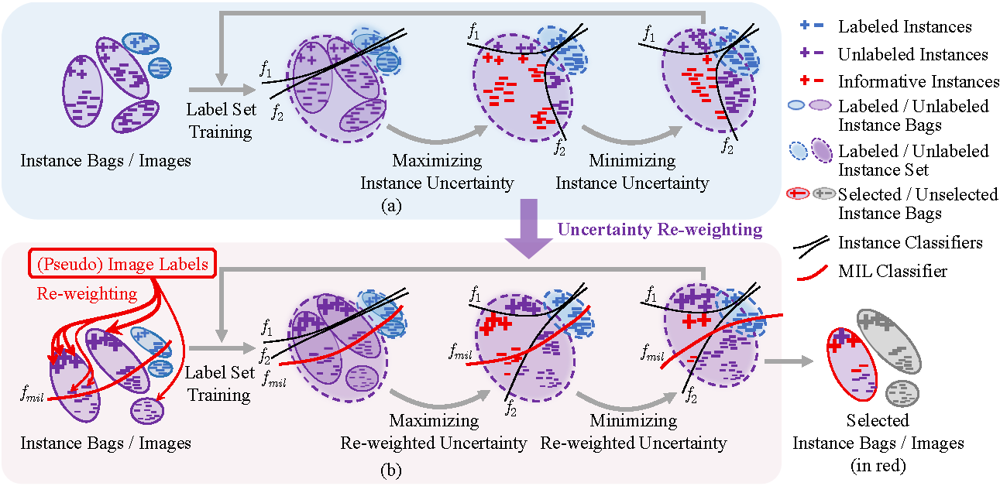
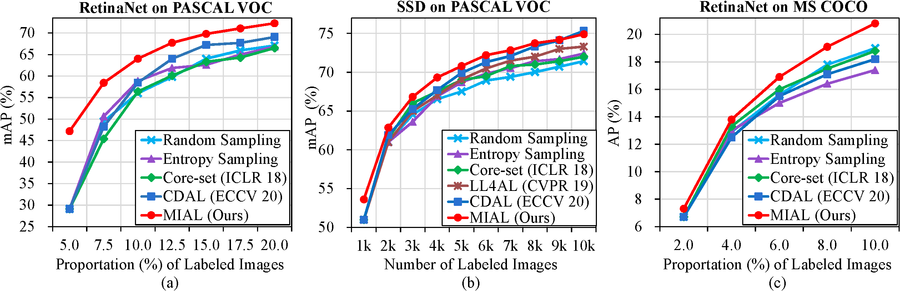

# MI-AOD

语言: 简体中文 | [English](./README.md)

## 简介

[comment:] <这是 [*Multiple Instance Active Learning for Object Detection（用于目标检测的多示例主动学习方法）*](https://github.com/yuantn/MI-AOD/raw/master/paper.pdf), CVPR 2021 一文的代码。>
这是 *Multiple Instance Active Learning for Object Detection（用于目标检测的多示例主动学习方法）* (PDF链接暂时不可用), CVPR 2021 一文的代码。

在本文中，我们提出了多示例主动目标检测（MI-AOD），通过观察示例级的不确定性来选择信息量最大的图像用于检测器的训练。多示例主动目标检测定义了示例不确定性学习模块，该模块利用在已标注集上训练的两个对抗性示例分类器的差异来预测未标注集的示例不确定性。多示例主动目标检测将未标注的图像视为示例包，并将图像中的特征锚视为示例，并通过以多示例学习（MIL）方式对示例重加权的方法来估计图像的不确定性。反复进行示例不确定性的学习和重加权有助于抑制噪声高的示例，来缩小示例不确定性和图像级不确定性之间的差距。



实验证明，多示例主动目标检测为示例级的主动学习设置了坚实的基线。在常用的目标检测数据集上，多示例主动目标检测和最新方法相比具有明显的优势，尤其是在已标注集很小的情况下。



## 安装

推荐使用 Linux 开发平台 (我们用的是 Ubuntu 18.04 LTS) 与 [anaconda3](https://www.anaconda.com/)，因为他们可以方便高效地安装与管理环境和 python 包。

推荐使用 TITAN V GPU，并且使用 [CUDA 10.2](https://developer.nvidia.com/cuda-toolkit-archive) 和 [CuDNN 7.6.5](https://developer.nvidia.com/cudnn)，因为他们可以加速模型训练。

在安装完anaconda3之后，你可以像这样创建一个 conda 环境：

```
conda create -n miaod python=3.7 -y
conda activate miaod
```

之后安装环境的过程请参见 [MMDetection v2.3.0](https://github.com/open-mmlab/mmdetection/tree/v2.3.0) 和其中的 [install.md 文件](https://github.com/open-mmlab/mmdetection/blob/v2.3.0/docs/install.md)。

然后，请像下面这样克隆这个代码库：

```
git clone https://github.com/yuantn/MI-AOD.git
cd MI-AOD
```

如果那样太慢的话，你也可以尝试像这样直接下载这个代码库：

```
wget https://github.com/yuantn/MI-AOD/archive/master.zip
unzip MI-AOD.zip
cd MI-AOD-master
```

## 修改mmcv包

为了能够同时训练两个 dataloader（即论文中提到的有标号的 dataloader 和无标号的 dataloader），需要修改 mmcv 包中的 ` epoch_based_runner.py ` 文件。

考虑到这会影响到所有使用这个环境的代码，所以我们建议为MI-AOD创建一个单独的环境（即上文中创建的 ` miaod ` 环境）。

```
cp -v epoch_based_runner.py ~/anaconda3/envs/miaod/lib/python3.7/site-packages/mmcv/runner/
```

之后如果你修改了 mmcv 包中的任何文件（包括但不限于：更新/重新安装了 Python、PyTorch、mmdetection、mmcv、mmcv-full、conda 环境），都应该重新将这个代码库中的 ` epoch_base_runner.py ` 文件再次复制到上面的 mmcv 文件夹下。([Issue #3](../../issues/3))

## 数据集准备

请从下面的链接处下载 VOC2007 数据集（*trainval* 部分 + *test* 部分）和 VOC2012 数据集（*trainval* 部分）：

VOC2007（*trainval* 部分）：http://host.robots.ox.ac.uk/pascal/VOC/voc2007/VOCtrainval_06-Nov-2007.tar

VOC2007（*test* 部分）：http://host.robots.ox.ac.uk/pascal/VOC/voc2007/VOCtest_06-Nov-2007.tar

VOC2012（*trainval* 部分）：http://host.robots.ox.ac.uk/pascal/VOC/voc2012/VOCtrainval_11-May-2012.tar

之后请确认文件夹的结构树像下面这样：
```
├── VOCdevkit
│   ├── VOC2007
│   │   ├── Annotations
│   │   ├── ImageSets
│   │   ├── JPEGImages
│   ├── VOC2012
│   │   ├── Annotations
│   │   ├── ImageSets
│   │   ├── JPEGImages
```
你也可以直接使用下面的命令行：
```
cd $你想要存放数据集的地址
wget http://host.robots.ox.ac.uk/pascal/VOC/voc2007/VOCtrainval_06-Nov-2007.tar
wget http://host.robots.ox.ac.uk/pascal/VOC/voc2007/VOCtest_06-Nov-2007.tar
wget http://host.robots.ox.ac.uk/pascal/VOC/voc2012/VOCtrainval_11-May-2012.tar
tar -xf VOCtrainval_06-Nov-2007.tar
tar -xf VOCtest_06-Nov-2007.tar
tar -xf VOCtrainval_11-May-2012.tar
```
之后，请修改这个代码库中对应的数据集地址部分，它们位于：
```
configs/MIAL.py 的第 1 行：data_root='$你想要存放数据集的地址/VOCdevkit/'
configs/_base_/voc0712.py 的第 1 行：data_root='$你想要存放数据集的地址/VOCdevkit/'
```
请把上面的 ` $你想要存放数据集的地址 ` 改为你实际的数据集地址（即你下载的 VOC 数据集的 tar 文件的地址）。

地址请使用绝对路径（如以 ` / ` 开始的路径），不要使用相对路径（如以 ` ./ ` 或 ` ../ ` 开始的路径）。

## 训练和测试

推荐使用 GPU 而不是 CPU 进行模型的训练和测试，因为 GPU 可以大大缩短训练时间。

推荐使用单个 GPU 进行训练与测试，因为多 GPU可能会导致 dataloader 多进程引发的错误。

如果只使用单个 GPU 训练，则可以直接像下面这样使用 ` script.sh ` 文件：
```
chmod 777 ./script.sh
./script.sh $你的 GPU ID 号
```
请将上面的 ` $你的 GPU ID 号 ` 修改为实际的 GPU ID 号（通常为一个自然数）.

如果是第一次运行 ` script.sh ` 文件的话，请忽略这个报错： ` rm: cannot remove './log_nohup/nohup_$你的 GPU ID 号.log': No such file or directory ` 。

 ` script.sh ` 文件会用 ID 号为 ` $你的 GPU ID 号 ` 的GPU，在 `(30000+$你的 GPU ID 号*100)` 端口号下训练与测试。

日志文件不会直接在终端中输出，但是会在 `./log_nohup/nohup_$你的 GPU ID 号.log` 和 ` ./work_dirs/MIAL/$时间戳.log ` 中保存与更新。这两个文件是相同的，你可以在 `./configs/MIAL.py` 的第 48 行修改后者的地址和名称。

如果你愿意的话，你也可以使用 ` './work_dirs/MIAL/ ` 目录下的其他文件，它们分别是：

- **JSON 文件 `$时间戳.log.json`**

  相比于使用 `./work_dirs/MIAL/$时间戳.log` 文件，你可以从 JSON 文件中更方便地加载训练时的损失（loss）和测试时的平均精确率（mAP）。
  
- **npy 文件 `X_L_$循环次数.npy` 和 `X_U_$循环次数.npy`**

   `$循环次数` 是主动学习的循环次数，是一个从 0 到 6 的整数。
   
  你可以从这些文件中加载每个循环中有标号和无标号的样本索引。
  
  对于 PASCAL VOC 数据集，索引为 0 到 16550 的整数，其中 0 到 5010 属于 PASCAL VOC 2007 数据集的 *trainval* 部分， 5011 到 16550 属于 PASCAL VOC 2012 数据集的 *trainval* 部分。

  加载这些文件的一段示例代码可以参考 `./tools/train.py` 文件的第 108-114 行（它们现在被注释掉了）。
  
- **pth 文件 `epoch_$迭代次数.pth` 和 `latest.pth`**

   `$迭代次数` 是最后一次有标号集合训练的迭代次数（epoch），是一个从 0 到 2 的整数。
   
  你可以直接从这些文件中加载训练的模型状态参数字典（model state dictionary）
  
  加载这些文件的一段示例代码可以参考 `./tools/train.py` 文件的第 109 行，第 143-145 行（它们现在被注释掉了）。
  
- **在每个 `cycle$循环次数` 目录 下的 txt 文件 `trainval_L_07.txt`、 `trainval_U_07.txt`、 `trainval_L_12.txt` 和 `trainval_U_12.txt`**

   `$循环次数` 的意义同上。

  你可以从这些文件中加载每个循环中有标号 JPEG 图像和无标号 JPEG 图像的名称。
  
  "L" 代表有标号， "U" 代表无标号。 "07" 代表 PASCAL VOC 2007 数据集的 *trainval* 部分， "12" 代表 PASCAL VOC 2012 数据集的 *trainval* 部分。

我们在 Google 云端硬盘和百度网盘中上传了一个示例输出文件夹，包括日志文件，最后一次训练得到的模型，以及上面所述的其他所有文件。

- **Google 云端硬盘:**

  [日志文件](https://drive.google.com/file/d/1dC2k3SCC_C9yvp2oIlStiVHbsyyh2QuC/view?usp=sharing)
  
  [最后一次训练得到的模型 (latest.pth)](https://drive.google.com/file/d/1gOaN3_R_QmeJ2bz0hczDmOXERTvMeSut/view?usp=sharing)
  
  [整个示例输出文件夹](https://drive.google.com/file/d/1oRiT-BBx8wlTWaXEO1_3xSGls9YeiCDA/view?usp=sharing)

- **百度网盘:**

  [日志文件 (提取码: kqsj)](https://pan.baidu.com/s/1FL7si7fxX86vwqqaYC3B_g)
  
  [最后一次训练得到的模型 (latest.pth) (提取码: 80v5)](https://pan.baidu.com/s/1EV4V-N1TeLc8IAF5rC0y2A)
  
  [整个示例输出文件夹 (提取码: 6kn2)](https://pan.baidu.com/s/1v_4frByp1_dNiPA_cuMqwQ)

## 代码结构
```
├── $你的 ANACONDA 安装地址
│   ├── anaconda3
│   │   ├── envs
│   │   │   ├── miaod
│   │   │   │   ├── lib
│   │   │   │   │   ├── python3.7
│   │   │   │   │   │   ├── site-packages
│   │   │   │   │   │   │   ├── mmcv
│   │   │   │   │   │   │   │   ├── runner
│   │   │   │   │   │   │   │   │   ├── epoch_based_runner.py
│
├── ...
│
├── configs
│   ├── _base_
│   │   ├── default_runtime.py
│   │   ├── retinanet_r50_fpn.py
│   │   ├── voc0712.py
│   ├── MIAL.py
│── log_nohup
├── mmdet
│   ├── apis
│   │   ├── __init__.py
│   │   ├── test.py
│   │   ├── train.py
│   ├── models
│   │   ├── dense_heads
│   │   │   ├── __init__.py
│   │   │   ├── MIAL_head.py
│   │   │   ├── MIAL_retina_head.py
│   │   │   ├── base_dense_head.py 
│   │   ├── detectors
│   │   │   ├── base.py
│   │   │   ├── single_stage.py
│   ├── utils
│   │   ├── active_datasets.py
├── tools
│   ├── train.py
├── work_dirs
│   ├── MIAL
├── script.sh
```

上面呈现出的代码文件和文件夹是 MI-AOD 的核心部分。为了避免潜在的问题，代码的其他文件和文件夹是跟随 MMDetection 的设定创建的。

每一个核心部分的代码文件和文件夹解释如下：

- **epoch_based_runner.py**: 每个迭代中训练和测试的代码，在 `./apis/train.py` 中调用。

- **configs**: 配置文件，包括运行设置，模型设置，数据集设置和其他主动学习和 MI-AOD 自定义的设置。

  - **\_\_base\_\_**: MMDetection 提供的基本配置文件夹，只需稍作修改就可以在 `.configs/MIAL.py` 中调用。

    - **default_runtime.py**: 运行设置的配置文件代码，在 `./configs/MIAL.py` 中调用。

    - **retinanet_r50_fpn.py**: 模型训练和测试的配置文件代码，在 `./configs/MIAL.py` 中调用。

    - **voc0712.py**: PASCAL VOC 数据集设置和数据预处理的配置文件代码，在 `./configs/MIAL.py` 中调用。

  - **MIAL.py**: MI-AOD 的常规配置代码，包括了主要的自定义设置，如主动学习数据集划分、模型训练和测试参数设置、自定义超参数设置、日志文件和模型存储设置，大多数都能在 `./tools/train.py` 中调用。在这个文件的注释中有每个参数更多的细节介绍。

- **log_nohup**: 暂时存储每个 GPU 上输出日志的日志文件夹。

- **mmdet**: MI-AOD 的核心代码文件夹，包括中间训练代码、目标检测器及其头部、以及主动学习数据集的划分。

  - **apis**: MI-AOD 的内层训练、测试、计算不确定度的代码文件夹。

    - **\_\_init\_\_.py**: 当前文件夹下一些函数的初始化。

    - **test.py**: 模型测试和计算不确定度的代码，在 `epoch_based_runner.py` 和 `./tools/train.py` 中调用。

    - **train.py**: 设置随机种子、创建训练用的 dataloader （为接下 epoch 级别的训练做好准备） 的代码，在 `./tools/train.py` 中调用。

  - **models**: 有关网络模型结构、训练损失（loss），测试过程中的前向传播、计算不确定度等细节的代码文件夹。

    - **dense_heads**: 训练损失（loss）和网络模型结构（尤其是精心设计的头部结构）的代码文件夹。

      - **\_\_init\_\_.py**: 当前文件夹下一些函数的初始化。

      - **MIAL_head.py**: 锚（anchor）级别的模型前向传播、计算损失（loss）、生成伪标号、从现有模型输出中得到检测框的代码，在 `./mmdet/models/dense_heads/base_dense_head.py` 和 `./mmdet/models/detectors/single_stage.py` 中调用。

      - **MIAL_retina_head.py**: 搭建 MI-AOD 网络结构（尤其是精心设计的头部结构）、定义前向输出的代码，在 `./mmdet/models/dense_heads/MIAL_head.py` 中调用。

      - **base_dense_head.py**: 选择不同公式计算损失（loss）的代码，在 `./mmdet/models/detectors/single_stage.py` 中调用。

    - **detectors**: 整体训练过程、测试过程、计算不确定度过程中前向传播和反向传播的代码文件夹。

      - **base.py**: 整理训练损失（loss）并输出、返回损失（loss）和图像信息的代码，在 `epoch_based_runner.py` 中调用。

      - **single_stage.py**: 提取图像特征、从模型输出中得到检测框、返回损失（loss）的代码，在 `./mmdet/models/detectors/base.py` 中调用。

  - **utils**: 划分主动学习数据集的代码文件夹。

    - **active_dataset.py**: 划分主动学习数据集的代码，包括创建初始的有标号集合、创建有标号和无标号的图像名称文件、在每次主动学习循环之后更新有标号和无标号的集合，在 `./tools/train.py` 中调用。

- **tools**: MI-AOD 的外层训练和测试的代码文件夹。

  - **train.py**: MI-AOD 的训练和测试代码，主要包括生成用于主动学习的 PASCAL VOC 数据集、加载图像集合和模型、示例不确定度重加权、信息丰富的图像挑选，在 `./script.sh` 中调用。

- **work_dirs**: 存放每个循环中有标号和无标号图像的名称和索引、所有日志和 json 文件输出、最后3个循环的模型状态参数字典（model state dictionary）的文件夹，在上面的 **训练和测试** 部分已经介绍过。

- **script.sh**: 在单 GPU 上运行 MI-AOD 的脚本。当你准备好 conda 环境和 PASCAL VOC 2007+2012 数据集后，你可以像上面 **训练和测试** 部分提到的那样简单直接地运行它来训练和测试 MI-AOD。

## 引用

[comment:] <如果你觉得这个代码库对你的论文有用，请考虑引用我们的[论文](https://github.com/yuantn/MI-AOD/raw/master/paper.pdf)。>
如果你觉得这个代码库对你的论文有用，请考虑引用我们的论文 (PDF链接暂时不可用)。
```angular2html
@inproceedings{MIAOD2021,
    author    = {Tianning Yuan and
                 Fang Wan and
                 Mengying Fu and
                 Jianzhuang Liu and
                 Songcen Xu and
                 Xiangyang Ji and
                 Qixiang Ye},
    title     = {Multiple Instance Active Learning for Object Detection},
    booktitle = {CVPR},
    year      = {2021}
}
```

## 致谢

在这个代码库中，我们在 [mmdetection](https://github.com/open-mmlab/mmdetection) 的基础上在 PyTorch 上成功复现了 RetinaNet 检测网络。
