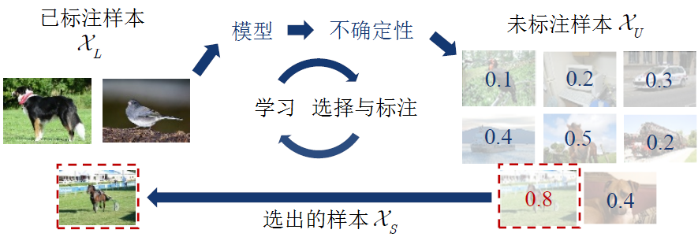
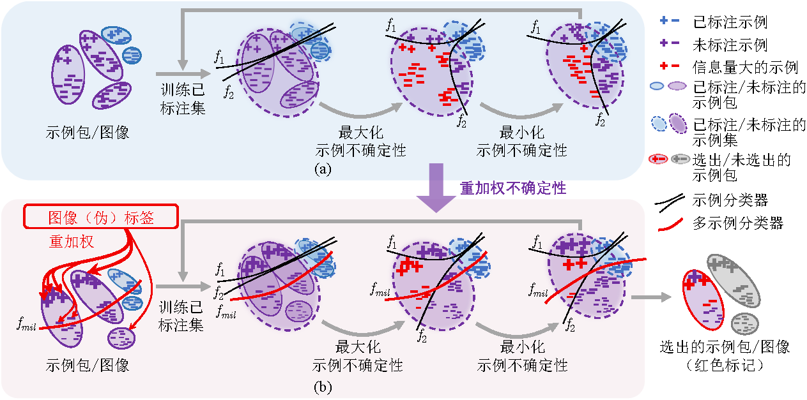
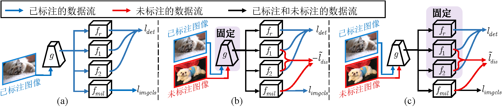
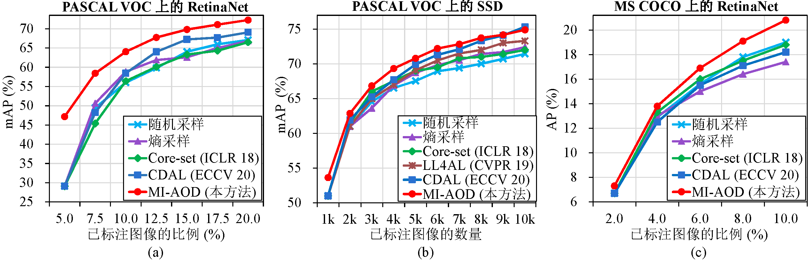
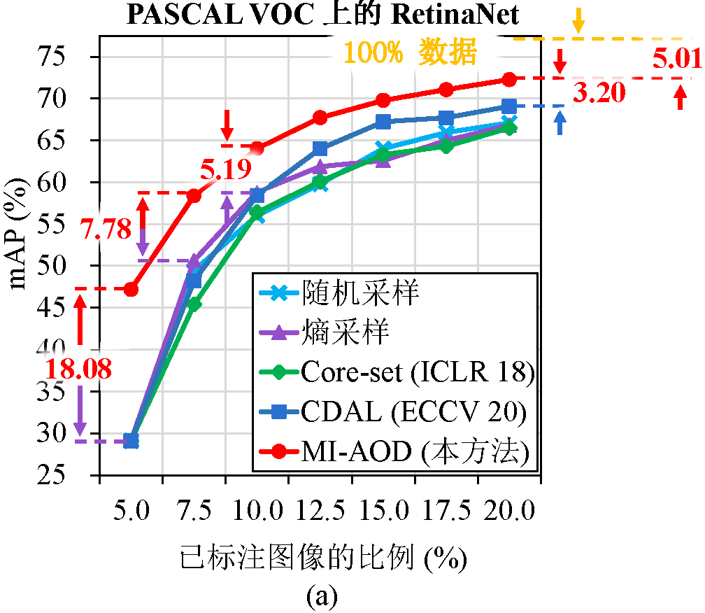

# MI-AOD

语言： 简体中文 | [English](README.md)


[](https://github.com/yuantn/mi-aod/blob/master/LICENSE)

[](https://paperswithcode.com/sota/active-object-detection-on-pascal-voc-07-12?p=multiple-instance-active-learning-for-object)
[](https://paperswithcode.com/sota/active-object-detection-on-coco?p=multiple-instance-active-learning-for-object)

[](https://github.com/yuantn/mi-aod/issues)
[](https://github.com/yuantn/mi-aod/issues)

<!-- TOC -->

- [简介](#简介)
- [快速入门](#快速入门)
- [模型库](#模型库)
- [贡献者](#贡献者)
- [开源许可证](#开源许可证)
- [引用](#引用)

<!-- TOC -->

## 简介

这是 [*Multiple Instance Active Learning for Object Detection（用于目标检测的多示例主动学习方法）*](https://openaccess.thecvf.com/content/CVPR2021/papers/Yuan_Multiple_Instance_Active_Learning_for_Object_Detection_CVPR_2021_paper.pdf) , CVPR 2021 一文的代码。

### 任务描述

在本文中，我们提出了 ***多示例主动目标检测（MI-AOD）*** ，通过观察示例级的不确定性来选择信息量最大的图像用于检测器的训练。

主动目标检测（用于目标检测的主动学习）的流程如下图所示。



在该任务中，一个较小的图像集合  （已标注集），带有示例标注  。此外还存在一个较大的图像集合  （未标注集），其中没有任何标注。对于每张图像，标签均由边界框（  ）和感兴趣物体的类别（  ）组成。

首先，通过使用已标注集{  }初始化检测模型  。基于初始化过的模型  ，主动学习的目的是从  中选择要手动标注的一组图像  ，并将其与  合并形成新的已标注集  ，即  。所选图像集  应该是信息量最大的，即可以尽可能提高检测性能。

> 上图中的信息量最大由不确定性（Uncertainty）表示，即将  中的样本输入到现有模型中，如果模型对于各个类别的输出分数更均匀，则该样本不确定性更高。

在更新后的已标注集  的基础上，任务模型被重新训练并更新为  。模型训练和样本选择过程重复几个周期，直到已标注图像的数量达到标注预算。

### 插图

多示例主动目标检测定义了示例不确定性学习模块，该模块利用在已标注集上训练的两个对抗性示例分类器的差异来预测未标注集的示例不确定性。多示例主动目标检测将未标注的图像视为示例包，并将图像中的特征锚视为示例，并通过以多示例学习（MIL）方式对示例重加权的方法来估计图像的不确定性。反复进行示例不确定性的学习和重加权有助于抑制噪声高的示例，来缩小示例不确定性和图像级不确定性之间的差距。

更多中文版的论文解读请点击 [这里](https://zhuanlan.zhihu.com/p/362764637) 和 [这里](https://blog.csdn.net/yuantn1996/article/details/115490388) 。





### 创新点

- 首次创造性地为 ***主动学习 + 目标检测*** 任务 ***量身定制*** 设计了一种方法。

- 在 PASCAL VOC 数据集上仅使用 ***20%*** 的数据就达到了 100% 数据性能的 ***93.5%*** 。

- ***首次*** 在 ***MS COCO*** 数据集上应用了主动学习，并取得了最优性能。

- 思路清晰简单，可推广至 ***任何类型*** 的检测模型。



### 更广泛的影响

MI-AOD 主要解决目标检测的问题，但是通过与以下任务结合，它也能推广到：
  - 任何其他的 **视觉目标检测任务** （如小目标检测，行人检测，医学图像检测）
  - 任何其他的 **计算机视觉任务** （如人体姿态检测，语义/实例分割，时序动作检测）
  - 任何其他的 **机器学习任务** （如自然语言处理）

这种自底向上和自顶向下的思想可以被推广应用到上面所有的任务。

注意到在 MI-AOD 中，主动学习在视觉目标检测中起到了很大作用，而其他带有少量监督信息的机器学习方法也能与之结合，例如：
  - 主动的 **小样本** 学习
  - 主动的 **半/弱/自监督** 学习
  - 主动的 **迁移** 学习
  - 主动的 **强化** 学习
  - 主动的 **增量** 学习
 
等等。这些主动学习和其他机器学习方法的结合可以更大程度上地发挥各自的作用。

## 快速入门

### 安装

请参考 [安装文档](./docs/installation_cn.md) 进行安装。

### 数据集准备

请从下面的链接处下载 VOC2007 数据集（*trainval* 部分 + *test* 部分）和 VOC2012 数据集（*trainval* 部分）：

VOC2007（*trainval* 部分）：http://host.robots.ox.ac.uk/pascal/VOC/voc2007/VOCtrainval_06-Nov-2007.tar

VOC2007（*test* 部分）：http://host.robots.ox.ac.uk/pascal/VOC/voc2007/VOCtest_06-Nov-2007.tar

VOC2012（*trainval* 部分）：http://host.robots.ox.ac.uk/pascal/VOC/voc2012/VOCtrainval_11-May-2012.tar

之后请确认文件夹的结构树像下面这样：

```
├── VOCdevkit
│   ├── VOC2007
│   │   ├── Annotations
│   │   ├── ImageSets
│   │   ├── JPEGImages
│   ├── VOC2012
│   │   ├── Annotations
│   │   ├── ImageSets
│   │   ├── JPEGImages
```

你也可以直接使用下面的命令行：

```bash
cd $你的数据集地址
wget http://host.robots.ox.ac.uk/pascal/VOC/voc2007/VOCtrainval_06-Nov-2007.tar
wget http://host.robots.ox.ac.uk/pascal/VOC/voc2007/VOCtest_06-Nov-2007.tar
wget http://host.robots.ox.ac.uk/pascal/VOC/voc2012/VOCtrainval_11-May-2012.tar
tar -xf VOCtrainval_06-Nov-2007.tar
tar -xf VOCtest_06-Nov-2007.tar
tar -xf VOCtrainval_11-May-2012.tar
```

如果你想使用 SSD 检测器而不是 RetinaNet 检测器，你可以像下面这样替换这个代码库中的配置文件：

```bash
mv configs/MIAOD.py configs/MIAOD_Retina.py
mv configs/MIAOD_SSD.py configs/MIAOD.py
```

对于 SSD 检测器而言，由于 mmcv 1.0.5 版本的包中所提供的 vgg16 预训练模型链接已不可用，需要将加载预训练模型链接的 json 文件更新到最新版本：

```bash
wget https://github.com/open-mmlab/mmcv/raw/master/mmcv/model_zoo/open_mmlab.json
cp -v open_mmlab.json $你的_ANACONDA_安装地址/envs/miaod/lib/python3.7/site-packages/mmcv/model_zoo/
```

请将 `$你的_ANACONDA_安装地址` 改为你实际的 Anaconda3 安装目录。通常它是 `~/anaconda3`。

之后，请修改这个代码库中对应的数据集地址部分，它们位于：

```python
configs/MIAOD.py 的第 2 行：data_root='$YOUR_DATASET_PATH/VOCdevkit/'
configs/_base_/voc0712.py 的第 2 行：data_root='$YOUR_DATASET_PATH/VOCdevkit/'
```

请把上面的 `$YOUR_DATASET_PATH` 和 `$你的数据集地址` 改为你实际的数据集地址（即你下载的 VOC 数据集的 tar 文件的地址）。

地址请使用绝对路径（如以 `/` 开始的路径），不要使用相对路径（如以 `./` 或 `../` 开始的路径）。

有关其他变量和参数的信息，请参考 [这里](configs/README_cn.md)。

有关 MS COCO 上的数据集准备，请参考 [这里](for_coco/README_cn.md)。

## 训练和测试

推荐使用 GPU 而不是 CPU 进行模型的训练和测试，因为 GPU 可以大大缩短训练时间。

推荐使用单个 GPU 进行训练与测试，因为多 GPU可能会导致 dataloader 多进程引发的错误。

不过，感谢 [@Kevin Chow](https://github.com/kevinchow1993)， [这里](../../issues/11) 有一个在多个 GPU 上训练的可行方法。

如果只使用单个 GPU 训练，则可以直接像下面这样使用 `script.sh` 文件：

```bash
chmod 700 ./script.sh
./script.sh $你的_GPU_ID_号
```

请将上面的 `$你的_GPU_ID_号` 修改为实际的 GPU ID 号（通常为一个自然数）.

如果是第一次运行 `script.sh` 文件的话，请忽略这个报错：

```bash
rm: cannot remove './log_nohup/nohup_$你的_GPU_ID_号.log': No such file or directory
```

`script.sh` 文件会用 ID 号为 `$你的_GPU_ID_号` 的GPU，在 `(30000+$你的_GPU_ID_号*100)` 端口号下训练与测试。

日志文件不会直接在终端中输出，但是会在 `log_nohup/nohup_$你的_GPU_ID_号.log` 和 `work_dirs/MI-AOD/$时间戳.log` 中保存与更新。这两个文件是相同的，你可以在 `configs/MIAOD.py` 的第 48 行修改后者的地址和名称。

如果你想直接在终端输出，你可以不使用 `script.sh`，而是运行下面这些命令：

```bash
# 单 GPU 训练
python tools/train.py $配置文件地址

# 多 GPU 训练
tools/dist_train.sh $配置文件地址 $GPU_数量
```

其中 `$配置文件地址` 应改为 `configs` 文件夹中的配置文件地址（通常应为 `configs/MIAOD.py`），
`$GPU_数量` 应改为所使用的所有 GPU 数量（不是 GPU 编号）。

类似地，这些是用于测试的代码：

```bash
# 单 GPU 测试
python tools/test.py $配置文件地址 $模型文件地址 --eval mAP

# 多 GPU 测试
tools/dist_test.sh $配置文件地址 $模型文件地址 $GPU_数量 --eval mAP
```

其中 `$模型文件地址` 应改为训练后 `work_dirs` 文件夹中的模型文件（\*.pth）的地址。

如果你想在单张图像上进行推理测试，可使用如下命令行：

```bash
python tools/test_single.py $配置文件地址 $模型文件地址 $图像地址 $输出文件名
```

其中 `$图像地址` 应改为你想要推理测试的图像地址， `$输出文件名` 应改为输出结果的文件名，通常以 `.jpg`、`.png` 等结尾。

在输出一张带有边界框和分数的图像的同时，终端也会同时输出这张图像的不确定性。

如果你有任何问题，请随时在 [问题](https://github.com/yuantn/mi-aod/issues) 中留言。

请参考 [常见问题解答](./docs/FAQ_cn.md) 来查看大家的常见问题。

### 代码结构

```
├── $你的 ANACONDA 安装地址
│   ├── anaconda3
│   │   ├── envs
│   │   │   ├── miaod
│   │   │   │   ├── lib
│   │   │   │   │   ├── python3.7
│   │   │   │   │   │   ├── site-packages
│   │   │   │   │   │   │   ├── mmcv
│   │   │   │   │   │   │   │   ├── runner
│   │   │   │   │   │   │   │   │   ├── epoch_based_runner.py
│
├── ...
│
├── configs
│   ├── _base_
│   │   ├── default_runtime.py
│   │   ├── retinanet_r50_fpn.py
│   │   ├── voc0712.py
│   ├── MIAOD.py
│── log_nohup
├── mmdet
│   ├── apis
│   │   ├── __init__.py
│   │   ├── inference.py
│   │   ├── test.py
│   │   ├── train.py
│   ├── models
│   │   ├── dense_heads
│   │   │   ├── __init__.py
│   │   │   ├── MIAOD_head.py
│   │   │   ├── MIAOD_retina_head.py
│   │   │   ├── base_dense_head.py 
│   │   ├── detectors
│   │   │   ├── base.py
│   │   │   ├── single_stage.py
│   ├── utils
│   │   ├── active_datasets.py
├── tools
│   ├── test.py
│   ├── test_single.py
│   ├── train.py
├── work_dirs
│   ├── MI-AOD
├── script.sh
```

上面呈现出的代码文件和文件夹是 MI-AOD 的核心部分。为了避免潜在的问题，代码的其他文件和文件夹是跟随 MMDetection 的设定创建的。

每一个核心部分的代码文件和文件夹解释如下：

- **epoch_based_runner.py**: 每个迭代中训练和测试的代码，在 `apis/train.py` 中调用。

- **configs**: 配置文件，包括运行设置，模型设置，数据集设置和其他主动学习和 MI-AOD 自定义的设置。

  - **\_\_base\_\_**: MMDetection 提供的基本配置文件夹，只需稍作修改就可以在 `configs/MIAOD.py` 中调用。

    - **default_runtime.py**: 运行设置的配置文件代码，在 `configs/MIAOD.py` 中调用。

    - **retinanet_r50_fpn.py**: 模型训练和测试的配置文件代码，在 `configs/MIAOD.py` 中调用。

    - **voc0712.py**: PASCAL VOC 数据集设置和数据预处理的配置文件代码，在 `configs/MIAOD.py` 中调用。

  - **MIAOD.py**: MI-AOD 的常规配置代码，包括了主要的自定义设置，如主动学习数据集划分、模型训练和测试参数设置、自定义超参数设置、日志文件和模型存储设置，大多数都能在 `tools/train.py` 中调用。在这个文件的注释中有每个参数更多的细节介绍。

- **log_nohup**: 暂时存储每个 GPU 上输出日志的日志文件夹。

- **mmdet**: MI-AOD 的核心代码文件夹，包括中间训练代码、目标检测器及其头部、以及主动学习数据集的划分。

  - **apis**: MI-AOD 的内层训练、测试、计算不确定度的代码文件夹。

    - **\_\_init\_\_.py**: 当前文件夹下一些函数的初始化。
    
    - **inference.py**: 推断模型和计算不确定度的代码，在 `tools/test_single.py` 中调用。

    - **test.py**: 模型测试和计算不确定度的代码，在 `epoch_based_runner.py`、`tools/test.py` 和 `tools/train.py` 中调用。

    - **train.py**: 设置随机种子、创建训练用的 dataloader （为接下 epoch 级别的训练做好准备） 的代码，在 `tools/train.py` 中调用。

  - **models**: 有关网络模型结构、训练损失（loss），测试过程中的前向传播、计算不确定度等细节的代码文件夹。

    - **dense_heads**: 训练损失（loss）和网络模型结构（尤其是精心设计的头部结构）的代码文件夹。

      - **\_\_init\_\_.py**: 当前文件夹下一些函数的初始化。

      - **MIAOD_head.py**: 锚（anchor）级别的模型前向传播、计算损失（loss）、生成伪标号、从现有模型输出中得到检测框的代码，在 `mmdet/models/dense_heads/base_dense_head.py` 和 `mmdet/models/detectors/single_stage.py` 中调用。

      - **MIAOD_retina_head.py**: 搭建 MI-AOD 网络结构（尤其是精心设计的头部结构）、定义前向输出的代码，在 `mmdet/models/dense_heads/MIAOD_head.py` 中调用。

      - **base_dense_head.py**: 选择不同公式计算损失（loss）的代码，在 `mmdet/models/detectors/single_stage.py` 中调用。

    - **detectors**: 整体训练过程、测试过程、计算不确定度过程中前向传播和反向传播的代码文件夹。

      - **base.py**: 整理训练损失（loss）并输出、返回损失（loss）和图像信息的代码，在 `epoch_based_runner.py` 中调用。

      - **single_stage.py**: 提取图像特征、从模型输出中得到检测框、返回损失（loss）的代码，在 `mmdet/models/detectors/base.py` 中调用。

  - **utils**: 划分主动学习数据集的代码文件夹。

    - **active_dataset.py**: 划分主动学习数据集的代码，包括创建初始的有标号集合、创建有标号和无标号的图像名称文件、在每次主动学习循环之后更新有标号和无标号的集合，在 `tools/train.py` 中调用。

- **tools**: MI-AOD 的外层训练和测试的代码文件夹。

  - **test.py**: MI-AOD 在整个测试集上用训练好的模型测试的代码。
  
  - **test_single.py**: MI-AOD 在测试集的单张图像上用训练好的模型测试的代码。
  
  - **train.py**: MI-AOD 的训练和测试代码，主要包括生成用于主动学习的 PASCAL VOC 数据集、加载图像集合和模型、示例不确定度重加权、信息丰富的图像挑选，在 `script.sh` 中调用。

- **work_dirs**: 存放每个循环中有标号和无标号图像的名称和索引、所有日志和 json 文件输出、最后3个循环的模型状态参数字典（model state dictionary）的文件夹，在上面的 **训练和测试** 部分已经介绍过。

- **script.sh**: 在单 GPU 上运行 MI-AOD 的脚本。当你准备好 conda 环境和 PASCAL VOC 2007+2012 数据集后，你可以像上面 **训练和测试** 部分提到的那样简单直接地运行它来训练和测试 MI-AOD。

## 模型库

### 模型

主动学习中最后一个周期（即使用 20% 的已标注数据时）训练好的模型可以从 [Google 云端硬盘](https://drive.google.com/file/d/1IU29AckAhMaLLjZNSHSCsE3m9SMCKVMq/view?usp=sharing) 和 [百度网盘 (提取码: 1y9x)](https://pan.baidu.com/s/1uSYIpvgN7A95YhtZjujvqg) 上下载得到。

### 结果



|已标注图像的比例（%）|5.0|7.5|10.0|12.5|15.0|17.5|20.0|100.0（全监督）|
|:----:|:----:|:----:|:----:|:----:|:----:|:----:|:----:|:----:|
|MI-AOD 的 mAP（%）| 47.18 | 58.41 | 64.02 | 67.72 | 69.79 | 71.07 | 72.27 | 77.28 |
|性能对全监督的比例 （%）|61.05|75.58|82.84|87.63|90.31|91.96|93.52|100.00|

训练和测试的日志文件可以从 [Google 云端硬盘](https://drive.google.com/file/d/1AabLGMoVyUjB7GiqLlLuvRgkGmzuNzqk/view?usp=sharing) 和 [百度网盘 (提取码: 7a6m)](https://pan.baidu.com/s/1DKRtv6U0lNkAvzLmfYVu8g) 上下载得到。

我们在 Google 云端硬盘和百度网盘中上传了一个示例输出文件夹，包括日志文件，最后一次训练得到的模型，以及上面所述的其他所有文件。

如果你愿意的话，你也可以使用 `work_dirs/MI-AOD/` 目录下的其他文件，它们分别是：

- **JSON 文件 `$时间戳.log.json`**

  相比于使用 `work_dirs/MI-AOD/$时间戳.log` 文件，你可以从 JSON 文件中更方便地加载训练时的损失（loss）和测试时的平均精确率（mAP）。
  
- **npy 文件 `X_L_$循环次数.npy` 和 `X_U_$循环次数.npy`**

   `$循环次数` 是主动学习的循环次数，是一个从 0 到 6 的整数。
   
  你可以从这些文件中加载每个循环中有标号和无标号的样本索引。
  
  对于 PASCAL VOC 数据集，索引为 0 到 16550 的整数，其中 0 到 5010 属于 PASCAL VOC 2007 数据集的 *trainval* 部分， 5011 到 16550 属于 PASCAL VOC 2012 数据集的 *trainval* 部分。

  加载这些文件的一段示例代码可以参考 `tools/train.py` 文件的第 108-114 行（它们现在被注释掉了）。
  
- **pth 文件 `epoch_$迭代次数.pth` 和 `latest.pth`**

   `$迭代次数` 是最后一次有标号集合训练的迭代次数（epoch），是一个从 0 到 2 的整数。
   
  你可以直接从这些文件中加载训练的模型状态参数字典（model state dictionary）
  
  加载这些文件的一段示例代码可以参考 `tools/train.py` 文件的第 109 行，第 133-135 行（它们现在被注释掉了）。
  
- **在每个 `cycle$循环次数` 目录 下的 txt 文件 `trainval_L_07.txt`、 `trainval_U_07.txt`、 `trainval_L_12.txt` 和 `trainval_U_12.txt`**

   `$循环次数` 的意义同上。

  你可以从这些文件中加载每个循环中有标号 JPEG 图像和无标号 JPEG 图像的名称。
  
  "L" 代表有标号， "U" 代表无标号。 "07" 代表 PASCAL VOC 2007 数据集的 *trainval* 部分， "12" 代表 PASCAL VOC 2012 数据集的 *trainval* 部分。

在 [Google 云端硬盘](https://drive.google.com/file/d/1tJnGLwvfYm9wpObpUpH5qO8jC9JscO8q/view?usp=sharing) 和 [百度网盘 (提取码: ztd6)](https://pan.baidu.com/s/19VmBzGWlLbqY9luFC9EwCg) 上提供了一个样例输出文件夹，其中包括日志文件、最后一次训练的模型、和以上其他所有文件。

## 贡献者

在这个代码库中，我们在 [mmdetection](https://github.com/open-mmlab/mmdetection) 的基础上在 PyTorch 上成功复现了 RetinaNet 检测网络。感谢他们的贡献。

## 开源许可证
该项目开源自 [Apache 2.0 license](./LICENSE)。

## 引用

如果你觉得这个代码库对你的论文有用，请考虑引用我们的[论文](https://openaccess.thecvf.com/content/CVPR2021/papers/Yuan_Multiple_Instance_Active_Learning_for_Object_Detection_CVPR_2021_paper.pdf)。

```bibtex
@inproceedings{MIAOD2021,
    author    = {Tianning Yuan and
                 Fang Wan and
                 Mengying Fu and
                 Jianzhuang Liu and
                 Songcen Xu and
                 Xiangyang Ji and
                 Qixiang Ye},
    title     = {Multiple Instance Active Learning for Object Detection},
    booktitle = {CVPR},
    year      = {2021}
}
```

[](https://github.com/yuantn/MI-AOD/stargazers)
